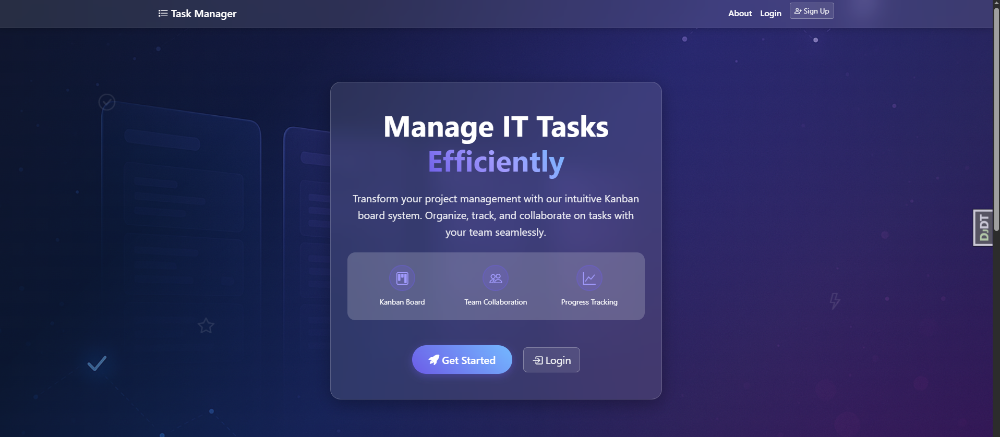
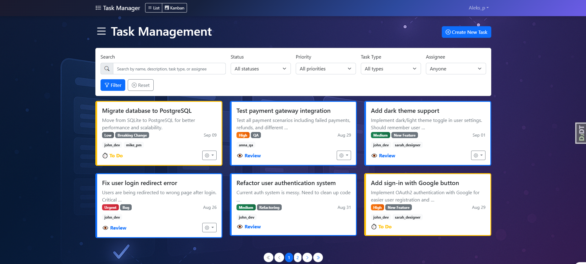

# py-it-tasks-manager

> Professional task management tool for IT teams. Organize, track, and collaborate on your projects with our intuitive Kanban board and task management system.


## 🚀 Demo




A modern, responsive web application for managing IT projects and tasks with a beautiful interface and powerful features.

### Landing Page
- Professional landing page with feature overview
- Responsive design for all devices
- Call-to-action buttons and user registration

### Dashboard Features
- **Kanban Board**: Visual project management with drag & drop
- **Task Management**: Create, edit, and track tasks
- **User Authentication**: Secure login and registration system
- **Role-based Permissions**: Control access to tasks and projects
- **Real-time Updates**: Status changes with visual feedback

## ✨ Features

This project makes it easy to:

* **Organize Tasks**: Create and categorize tasks with priorities and deadlines
* **Visual Management**: Use Kanban board with drag & drop functionality
* **Team Collaboration**: Assign tasks to team members and track progress
* **Status Tracking**: Monitor task progress through different stages (To Do → In Progress → Review → Done)
* **Search & Filter**: Quickly find tasks using search and filtering options
* **Responsive Design**: Access your tasks on any device
* **User Management**: Secure authentication and user profile management

## 🛠️ Technology Stack

- **Backend**: Django 5.0+
- **Frontend**: Bootstrap 5.2.3, Vanilla JavaScript
- **Database**: SQLite (development), PostgreSQL (production ready)
- **Styling**: Custom CSS with Bootstrap components
- **Icons**: Bootstrap Icons

## 📋 Prerequisites

Before you begin, ensure you have met the following requirements:

* Python 3.10 or higher
* pip (Python package manager)
* Git

## 🔧 Installation & Setup

1. **Clone the repository**
   ```bash
   git clone https://github.com/yourusername/py-it-tasks-manager.git
   cd py-it-tasks-manager
   ```

2. **Create virtual environment**
   ```bash
   python -m venv .venv
   
   # On Windows
   .venv\Scripts\activate
   
   # On macOS/Linux
   source .venv/bin/activate
   ```

3. **Install dependencies**
   ```bash
   pip install -r requirements.txt
   ```

4. **Environment setup**
   ```bash
   # Copy environment variables
   cp .env.example .env
   
   # Edit .env file with your settings
   ```

5. **Database setup**
   ```bash
   python manage.py makemigrations
   python manage.py migrate
   ```

6. **Create superuser (optional)**
   ```bash
   python manage.py createsuperuser
   ```

7. **Run the development server**
   ```bash
   python manage.py runserver
   ```

8. **Access the application**
   - Main application: http://127.0.0.1:8000/
   - Admin panel: http://127.0.0.1:8000/admin/

## 📁 Project Structure

```
py-it-tasks-manager/
├── accounts/                 # User authentication app
├── manager/                  # Main task management app
├── py_it_tasks_manager/      # Django project settings
├── static/                   # Static files (CSS, JS, images)
│   ├── css/
│   │   ├── styles.css       # Main application styles
│   │   └── landing.css      # Landing page styles
│   ├── js/                  # JavaScript functionality
│   │   ├── kanban-dnd.js    # Drag & drop for Kanban
│   │   ├── kanban-search.js # Search functionality
│   │   └── task-status-toggle.js
│   └── images/              # Application images
├── templates/               # HTML templates
│   ├── includes/           # Reusable components
│   │   ├── navbar.html     # Application navbar
│   │   └── navbar_landing.html # Landing navbar
│   ├── landing/            # Landing page templates
│   └── manager/            # Task management templates
├── requirements.txt        # Python dependencies
└── README.md
└── demo.png
└── demo2.png
```

## 🎯 Usage

### Creating Tasks
1. Navigate to the dashboard
2. Click "Create New Task"
3. Fill in task details (name, description, priority, assignees)
4. Set deadline and task type
5. Save the task

### Using Kanban Board
1. Go to Kanban view
2. Drag and drop tasks between columns
3. Use search to filter tasks
4. Tasks automatically save their new status

### Managing Users
1. Admin users can access user management
2. Assign tasks to team members
3. Control user permissions and roles

## 🤝 Contributing

Contributions are welcome! Here's how you can help:

1. **Fork the repository**
2. **Create a feature branch**
   ```bash
   git checkout -b feature/amazing-feature
   ```
3. **Make your changes**
4. **Commit your changes**
   ```bash
   git commit -m 'Add some amazing feature'
   ```
5. **Push to the branch**
   ```bash
   git push origin feature/amazing-feature
   ```
6. **Open a Pull Request**

### Development Guidelines

- Follow PEP 8 style guidelines for Python code
- Write meaningful commit messages
- Add comments for complex logic
- Test your changes thoroughly
- Update documentation when necessary

## 🐛 Known Issues & Troubleshooting

### Common Issues

**Issue**: Static files not loading
**Solution**: Run `python manage.py collectstatic`

**Issue**: Database errors
**Solution**: Run migrations with `python manage.py migrate`

**Issue**: Permission denied errors
**Solution**: Check user permissions and authentication

## 📝 TODO / Roadmap

- [ ] Add email notifications for task assignments
- [ ] Implement task comments and file attachments
- [ ] Add time tracking functionality
- [ ] Create mobile application
- [ ] Add integration with external tools (Slack, Jira)
- [ ] Implement advanced reporting and analytics